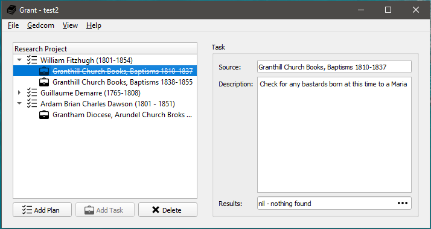

# Grant - The Genealogical Research AssistaNT

Grant is a tool for genealogists to organize their research. It is based on the idea of [Research Logs](https://www.familysearch.org/wiki/en/Research_Logs), where each ancestor (or any family member really) is recorded with the sources that have been searched and the result of those searches along with any documents created.

To try it out, download the [latest release](https://github.com/pkuehne/grant/releases/latest).

## Features

- Store your research in a YAML file - no proprietary lock-in and easy enough to read with notepad
- Divides research up into Plans each with multiple Tasks to track specific sources
- Filter Plans/Tasks by keywords, status, etc
- Autocomplete names of ancestors and sources from linked gedcom file
- Available for Windows, (Debian-based) Linux, MacOS (untested)

## Coming Soon

- Add more links to tasks like repository or location to easily group research
- Filter Plans/Tasks by linked individuals/families/locations/etc
- Keep track of correspondence with repositories and archives
- Store your research as a Note inside your GEDCOM file and never lose it
- Print the research logs for hard-copy storage

See more on the [Feature Ideas](https://github.com/pkuehne/grant/projects/1) board.

# Development

If you are interested in running the source code directly, here are some handy tips:

- To run the build: `python main.py`
- To run the tests: `python -m pytest tests`
- To generate the `resources.py` file: `pyrcc5 grant.qrc -o resources.py`
- To create an executable: `pyinstaller --onefile --windowed main.py`
